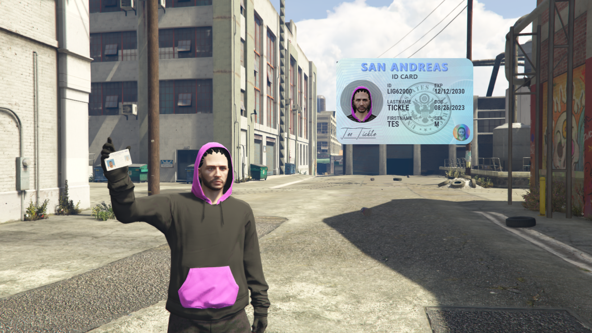

# Byte Labs - ID Card
A customisable system with an immaculate ID card design for your FiveM server.



Website: [Byte Labs](https://byte-labs.net)
Discord: [Byte Labs](https://discord.gg/fqsqSjZfxE)


## Features
- Customisable ID card design with a clean and modern look

## Dependencies
- [bl_bridge](https://github.com/Byte-Labs-Project/bl_bridge)
- [ox_lib](https://github.com/overextended/ox_lib)

## Installation
1. Download
2. Extract the `bl_idcard` folder to your resources directory
3. Add `ensure bl_idcard` to your server.cfg after bl_bridge
4. Follow [Docs](https://docs.byte-labs.net/bl_idcard) Instructions
4. Configure the `config.lua` to your liking


## Items
### OX Inventory
```lua
	["id_card"] = {
		label = "ID Card",
		weight = 0,
		stack = false,
		close = false,
		description = "A card containing all your information to identify yourself",
	},

    ["driver_license"] = {
		label = "Drivers License",
		weight = 0,
		stack = false,
		close = false,
		description = "Permit to show you can drive a vehicle",
	},

	["weaponlicense"] = {
		label = "Weapon License",
		weight = 0,
		stack = false,
		close = true,
		description = "Weapon License",
	},
```

### QB / QS / PS Inventory
```lua
    ['id_card']  = {
        name = 'id_card',
        label = 'ID Card',
        weight = 0,
        type = 'item',
        description = 'A card containing all your information to identify yourself',
        unique = true,
        useable = true,
        image = 'id_card.png',
        combinable = nil,
    },

    ['driver_license'] = {
        name = 'driver_license',
        label = 'Drivers License',
        weight = 0,
        type = 'item',
        description = 'Permit to show you can drive a vehicle',
        unique = true,
        useable = true,
        image = 'driver_license.png',
        combinable = nil,
    },

    ['weaponlicense'] = {
        name = 'weaponlicense',
        label = 'Weapon License',
        weight = 0,
        type = 'item',
        description = 'Weapon License',
        unique = true,
        useable = true,
        image = 'weaponlicense.png',
        combinable = nil,
    },
```
